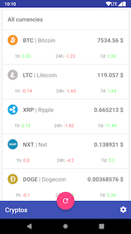

# CrpytoWatch
An Cryptocurrency tracker :money_with_wings: built for riding Android Jetpack :rocket:. During Google IO18 the Android team released some new libraries along with existing Android Architecture Components. This is aims to use most of <u>AAC</u> libraries in <u>MVVM</u> architecture and serve as a sample written in **Kotlin** :muscle:

## Components used

- **Lifecycle** - Used by `LiveData`.
- **LiveData** - For observing upon data in `ViewModel`.
- **ViewModel** - For managing UI data.
- **Room** - For persisting data. 
- **Paging** - For loading long list or infinite data in `RecyclerView`
- **Navigation** - For simplifying navigation using `Fragment`.
- **WorkManager** - For running repeated background `Work`. 
- **DataBinding** - For binding data with views in layout. 

### Other libraries used

- [Dagger 2](https://github.com/google/dagger) - For Dependency Injection. 
- [Retrofit 2](https://github.com/square/retrofit) - For making network call. 
- [Picasso](https://github.com/square/picasso) - For loading images into `ImageView`. 
- [Gson](https://github.com/google/gson) - For converting JSON to POJO and vice versa. 

## What does this app do?

Extremely simple app which just shows list of **cryptocurrencies** and their present market value. I have used [CoinMarketCap API](https://coinmarketcap.com/api/) as datasource for this application. You can add some currencies to watchlist which appear on top of home screen and in home screen widget. 

This app fetches data once from API using `Retrofit` and caches it using `Room`. The watchlist is stored in `SharedPreferences` as list of IDs. It used **Paging Libaray** for loading data from database in discrete manner and UI is bound with data using `DataBinding`. 

## Screenshots

## Prerequisites

- **Android Studio 3.2** or later because `Navigation` library is only supported on newer versions. 
- Android Device with...
  - **Android L** or above
  - Internet connection 
  - USB Debugging enabled

## To-Do

- [x] Add watchlist
- [ ] Write tests
- [ ] Create widget
- [ ] Integrate `DataBinding`

## Built With

- **Android Studio** - The Official IDE for Android. 
- **Kotlin** - The Official Language for Android by JetBrains. 
- **Gradle** - Build tool for Android Studio. 
- **Android Jetpack** - Set of libraries to make dev easier. 